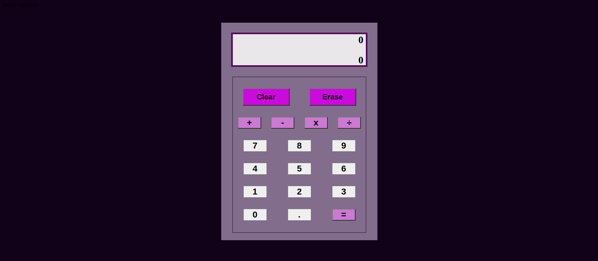
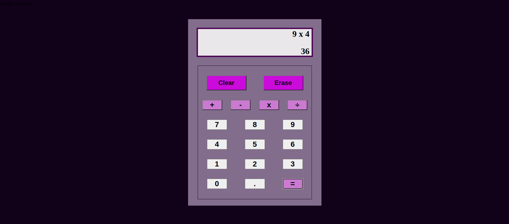

# Calculator-Project

**Objective**

The objective is to create a simple calculator using HTML, CSS, and JavaScript. 

***Calculator Images***

Blank Calculator:

Calculator in Use:

***Features***

1. The calculator has addition, subtraction, multiplication, and division capabilities using two numbers.
2. Numbers and answers can utilize the decimal. Only one decimal allowed per number.
3. The clear button will delete the history and answer rows.
4. The erase button will delete the last number set entered on the answer row.
5. The equal key will total the answer to the operation equation entered.
